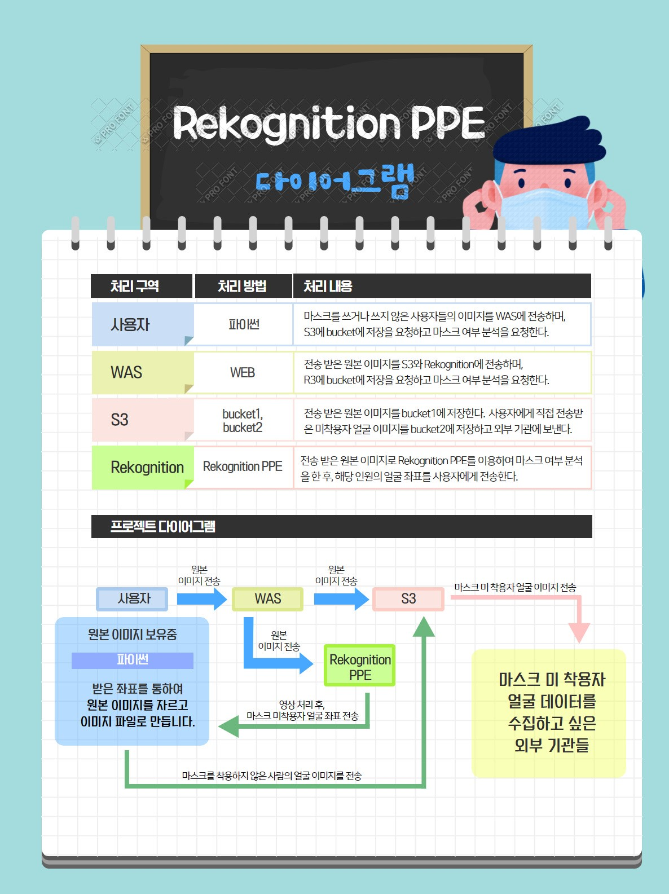

## 2020_2_Cloud_Computing_Term_Project
# 프로젝트 명: 마스크 인식 프로그램

## 팀 구성원

|학과|학번|이름|담당 파트|
|----------|---------|----------|----------|
|컴퓨터공학과|20165147|유병학|영상처리 프로그래밍|
|빅데이터전공|20165153|이재성|DB 관리 및 오류 수정|
|빅데이터전공|20165164|지현한|Rekoginition 서비스 활용 프로그래밍|


# 담당 파트 수정


- python 언어를 통해 프로그램을 만들었으며, 팀 구성원끼리 서로 피드백을 하며 진행함.
- 기타 사항
    - 대표학생: 이재성
    - 프로젝트 깃허브 주소: https://github.com/jaeseonglee/Cloud_Computing_Term_Project


## 프로젝트 소개 및 개발 내용 소개
---------
### 프로젝트 소개
- __AWS Rekognition 서비스를 활용하여 사람의 마스크 착용 여부를 확인하고, 미착용 시 얼굴을 저장하는 프로젝트입니다.__

 - 사람을 저장한다.


- 저희는 AWS Rekognition 서비스 중 PPE(개인 보호 장비)를 감지하는 서비스를 활용하여 프로그램을 개발했습니다.
    - PPE 감지는 기본적으로 사람을 감지하는 것과 동시에 그 사람이 장갑,헬멧,보호 마스크와 같은 보호장비를 감지하는데 사용합니다.

- 저희를 여기서 보호 마스크를 감지하는 것에서 아이디어를 얻었습니다. 아래와 같이 사람들의 일반 마스크 착용 여부도 확인할 수 있다는 것을 알아내고, 이를 활용하여 마스크 인식 프로젝트를 만들게 되었습니다.


 - 원본 사진 출처: 이재성
 - 위 사진이 사용된 출처: AWS Rekognition PPE 감지 페이지

### 개발내용 소개


- 개발에 있어 사용한 언어는 python을 통해 만들었으며 3.7 이상의 버전에서 진행했습니다. 

```python
#사용 모듈
import boto3
import from PIL import Image
```
- aws 서비스를 사용하기 위한 boto3와 이미지 파일을 다루기 위해 Image 모듈을 사용합니다.

```python
# 임시 코드
detect_protective_equipment(Image={'S3Object':{'Bucket':bucket,'Name':photo}})
```
- __detect_protective_equipment__ 함수를 통해 Rekognition의 PPE 감지 서비스를 사용합니다. 


```
{
    "Image": {
        "S3Object": {
            "Bucket": "bucket",
            "Name": "worker.jpg"
        }
    },
    "SummarizationAttributes": {
        "MinConfidence": 80,
        "RequiredEquipmentTypes": [
            "FACE_COVER",
            "HAND_COVER",
            "HEAD_COVER"
        ]
    }
}
```
- PPE 감지 서비스의 응답 내역 중 하나로 보호 장비가 감지되면 RequiredEquipmentTypes으로 우엇이 감지되었는지를 반환합니다.


- 함수의 반환값 중 사람이 감지된 영역인 BoundingBox 값과 마스크를 착용 했는지 확인하는 FACE_COVER의 값을 확인합니다.

-

- // 어떤 내용을 추가해야 하는가?
- ... //  __image__ 모듈을 사용해서 이미지 자르는 설명..
!!!!


/

/

이미지 감지
이미지가 맞는지 입력 파일은 jpg와 png만 받는다.

DetectProtectiveEquipment는 이미지에서 감지 된 최대 15 명이 착용 한 PPE를 감지합니다.
/

/

/

/

/
## 개발 결과물 소개 및 실행 결과
----------------------------------
### 프로젝트 개발 결과물 소개 (+ 다이어그램) - (D)
[프로그램 코드 링크: CC__Project.py](https://github.com/jaeseonglee/Cloud_Computing_Term_Project/blob/main/CloudComputing_project.py)

[결과이미지 다운로드 코드 링크: Download_result.py](https://github.com/jaeseonglee/Cloud_Computing_Term_Project/blob/main/Download_result.py)





### 개발 결과물을 사용하는 방법 소개 - (E)


1번 프로그램 구동을 하는 것을 첨부터 끝까지 

2번 사진이 

동영상


입력 이미지
잘린 이미지
aws S3 버킷화면을 보여줌


#### 사진 분석 및 결과 도출
마스크 미착용 사람 사진,
사람의 크기만 자른 사진 


## 개발 결과물의 필요성 및 활용방안
- SW의 필요성
    - 코로나 19 사태가 확산되어 __마스크 의무화__ 까지 생겼음에도 불구하고, 여전히 마스크를 쓰지 않는 사람들이 있습니다. 
    - 의도적으로 마스크를 착용하지 않는 사람들에게 경각심을 심어주기 위해서, 사용할 필요성이 있다고 생각합니다.
- 활용방안
    - 마스크 의무화에 반하는 사람들을 신고함에 따라 벌금형이 주어집니다.
    - 위 프로그램의 결과를 통해 그 사람들의 얼굴과 인상착의를 저장하는 확실한 증거로 사용될 것입니다.
     

