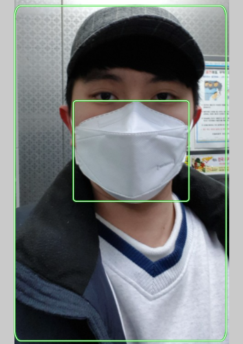

## 2020_2_Cloud_Computing_Term_Project
# 프로젝트 명: 마스크 인식 프로그램

## 팀 구성원

|학과|학번|이름|담당 파트|
|----------|---------|----------|----------|
|컴퓨터공학과|20165147|유병학|영상처리 프로그래밍|
|빅데이터전공|20165153|이재성|DB 관리 및 오류 수정|
|빅데이터전공|20165164|지현한|Rekoginition 서비스 활용 프로그래밍|
- python 언어를 통해 프로그램을 만들었으며, 팀 구성원끼리 서로 피드백을 하며 진행함.
- 기타 사항
    - 대표학생: 이재성
    - 깃허브 주소: https://github.com/jaeseonglee/Cloud_Computing_Term_Project

## 프로젝트 소개 및 개발 내용 소개
---------
### 프로젝트 소개
- __AWS Rekognition 서비스를 활용하여 사람의 마스크 착용 여부를 확인하고, 미착용 시 얼굴을 저장하는 프로젝트입니다.__

- 저희는 AWS Rekognition 서비스 중 PPE(개인 보호 장비)를 감지하는 서비스를 활용하여 프로그램을 개발했습니다.
    - PPE 감지는 기본적으로 사람을 감지하는 것과 동시에 그 사람이 장갑,헬멧,보호 마스크와 같은 보호장비를 감지하는데 사용합니다.

- 저희를 여기서 보호 마스크를 감지하는 것에서 아이디어를 얻었습니다. 아래와 같이 사람들의 일반 마스크 착용 여부도 확인할 수 있다는 것을 알아내고, 이를 활용하여 마스크 인식 프로젝트를 만들게 되었습니다.

 - 원본 사진 출처: 이재성
 - 위 사진이 사용된 출처: AWS Rekognition PPE 감지 페이지

### 개발내용 소개
- 개발에 있어 사용한 언어는 python을 통해 만들었으며 3.7 이상의 버전에서 진행했습니다. 
- 

## 프로젝트 개발 결과물 소개 (+ 다이어그램) - (D)

## 개발 결과물을 사용하는 방법 소개 - (E)
(+ 프로그램 구동 화면 스크린 샷 첨부)

#### 사진 분석 및 결과 도출
프로그램 동작 사진, 사람 사진, 마스크 사람 사진 추가 예정

## 개발 결과물의 필요성 및 활용방안 - (F)

### SW의 필요성 및 방향
- __코로나 19 사태가 확산되어 마스크 의무화까지 생겼음에도 불구하고, 여전히 마스크를 쓰지 않는 사람들이 있습니다.__
- __그래서 저희는 AWS Rekognition 서비스를 활용하여 마스크를 쓰지 않은 모습을 확인하고 얼굴을 식별합니다.__
- __식별된 사람들은 의도적으로 마스크를 쓰지 않은 것으로 판단하여 기록하고 얼굴을 캡처하여 저장합니다.__

