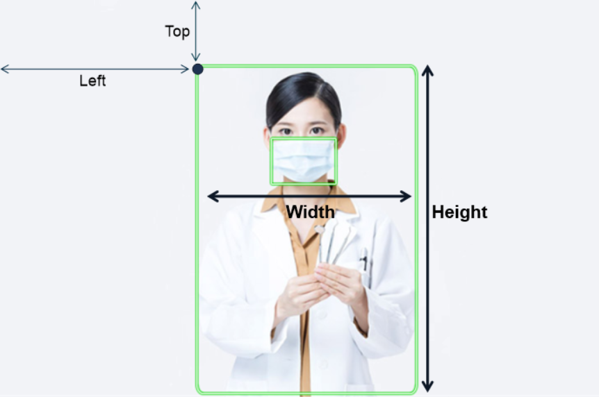
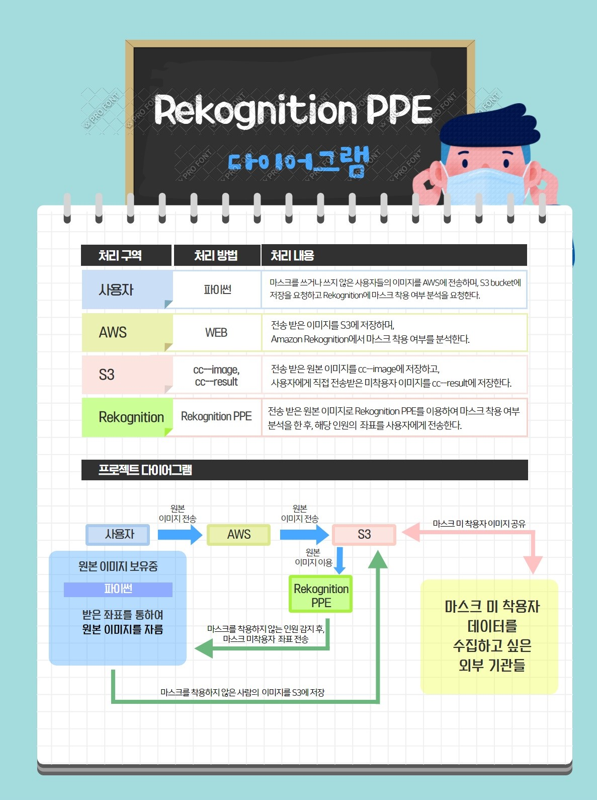

## 2020_2_Cloud_Computing_Term_Project
# 프로젝트 명: 마스크 인식 프로그램

## 팀 구성원

|학과|학번|이름|담당 파트|
|----------|---------|----------|----------|
|컴퓨터공학과|20165147|유병학|영상처리 프로그래밍|
|빅데이터전공|20165153|이재성|예외 처리 및 오류 수정|
|빅데이터전공|20165164|지현한|AWS 서비스 활용 프로그래밍|
- python 언어를 통해 프로그램을 만들었으며, 팀 구성원끼리 서로 피드백을 하며 진행함.
- 기타 사항
    - 대표학생: 이재성
    - 프로젝트 깃허브 주소: https://github.com/jaeseonglee/Cloud_Computing_Term_Project


## 프로젝트 소개 및 개발 내용 소개
---------
### 프로젝트 소개
- __AWS Rekognition 서비스를 활용하여 사람의 마스크 착용 여부를 확인하고, 착용하지 않은 사람을 저장하는 프로그램입니다.__

 - 저희는 AWS Rekognition 서비스 중 PPE(개인 보호 장비)를 감지하는 서비스를 활용하여 프로그램을 개발했습니다.
    - PPE 감지는 기본적으로 사람을 감지하는 것과 동시에 그 사람이 장갑, 헬멧, 보호 마스크와 같은 보호장비를 감지하는데 사용합니다.

- 저희를 여기서 보호 마스크를 감지하는 것에서 아이디어를 얻었습니다. 아래와 같이 사람들의 일반 마스크 착용 여부도 확인할 수 있다는 것을 알아내고, 이를 활용하여 마스크 인식 프로젝트를 만들게 되었습니다.


 - (원본 사진 출처: 이재성)
 - (위 사진이 사용된 출처: AWS Rekognition PPE 감지 페이지)

### 개발내용 소개

- 개발에 있어 사용한 언어는 python을 통해 만들었으며 3.7 이상의 버전에서 진행했습니다. 

```python
#사용 모듈
import boto3
import from PIL import Image
```
- aws 서비스를 사용하기 위한 boto3와 이미지 파일을 다루기 위해 Image 모듈을 사용합니다.

```python
detect_protective_equipment(Image={'S3Object':{'Bucket':bucket,'Name':photo}},
SummarizationAttributes={'MinConfidence':80, 'RequiredEquipmentTypes':['FACE_COVER']})
```
- __detect_protective_equipment__ 함수를 통해 Rekognition의 PPE 감지 서비스를 사용합니다. 

- 함수의 반환값 중에는 EquipmentDetections 가 있는데 __FACE_COVER, HAND_COVER, HEAD_COVER__ 중 __FACE_COVER__ 타입 유무를 확인해서 마스크 착용 여부를 판단합니다.

```python
BoundingBoxs = []   #사진에서 마스크를 쓰지 않은 사람들의 위치값들
for i in range(len(response['Persons'])):
        if(response['Persons'][i]['BodyParts'][0]["EquipmentDetections"] == []):   
            BoundingBoxs.append(response['Persons'][i]['BoundingBox']) #마스크 탐지 안됨
        elif(response['Persons'][i]['BodyParts'][0]["EquipmentDetections"][0]["CoversBodyPart"]["Value"] == False): 
            BoundingBoxs.append(response['Persons'][i]['BoundingBox'])
            #마스크를 제대로 착용하지 않음
```
- 함수에서 받은 반환값 중에서 __Persons__ 이 있다면 사람이 감지되었음.

- 사람을 감지한 영역인 __BoundingBox__ 내에서 EquipmentDetections가 없다면 그 영역을 검출

- 마스크 착용은 했지만 올바르지 않은 착용인 모습이면(ex: 코스크, 턱스크) 검출

- 위의 두가지 조건문에 해당하지 않은 사람이면 마스크 착용중인것으로 확인




- 해당 이미지에서  __Persons__ 이 검출된 영역과 __FACE_COVER__ 가 검출된 영역을 확인

- (사진 출처 : https://m.health.chosun.com/svc/news_view.html?contid=2020021203075)

```python
size = image.size

x1 = size[0] * BoundingBox['Left']
y1 = size[1] * BoundingBox['Top']
x2 = x1 + size[0] * BoundingBox['Width']
y2 = y1 + size[1] * BoundingBox['Height']

image.crop((x1,y1,x2,y2))
```
- 기존 입력된 이미지에서 __BoundingBox__ 의 좌표값의 이미지로 잘라주는 함수인 __crop__ 을 이용하여 이미지를 영상처리한다.

## 개발 결과물 소개 및 실행 결과
----------------------------------
### 프로젝트 개발 결과 코드 및 다이어그램
[프로그램 코드 링크: CC__Project.py](https://github.com/jaeseonglee/Cloud_Computing_Term_Project/blob/main/CloudComputing_project.py)

[결과이미지 다운로드 코드 링크: Download_result.py](https://github.com/jaeseonglee/Cloud_Computing_Term_Project/blob/main/Download_result.py)





### 개발 결과물을 사용하는 방법 소개 동영상 및 사진

###########################################################

1번 프로그램 구동을 하는 것을 첨부터 끝까지 

2번 사진이 

동영상


입력 이미지
잘린 이미지


aws S3 버킷화면을 보여줌


#### 사진 분석 및 결과 도출


마스크 미착용 사람 사진,
사람의 크기만 자른 사진 

###########################################################

## 개발 결과물의 필요성 및 활용방안
- SW의 필요성
    - 코로나 19 사태가 확산되어 __마스크 의무화__ 까지 생겼음에도 불구하고, 여전히 마스크를 쓰지 않는 사람들이 있습니다. 
    - 의도적으로 마스크를 착용하지 않는 사람들에게 경각심을 심어주기 위해서, 사용할 필요성이 있다고 생각합니다.
- 활용방안
    - 마스크 의무화에 반하는 사람들을 신고함에 따라 벌금형이 주어집니다.
    - 위 프로그램의 결과를 통해 그 사람들의 얼굴과 인상착의를 저장하는 확실한 증거로 사용될 것입니다.
     